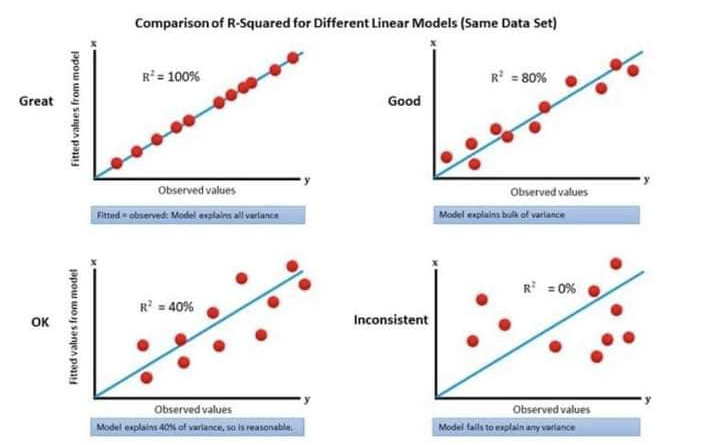
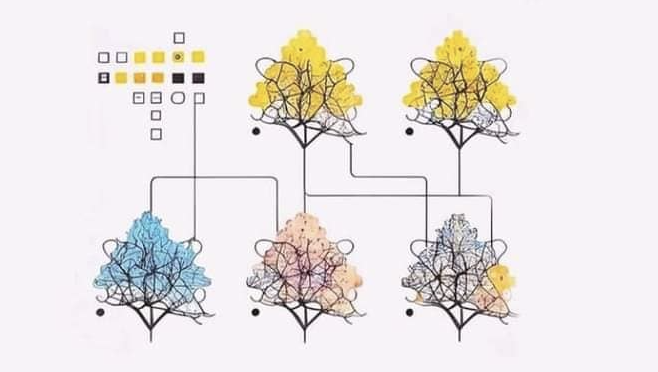
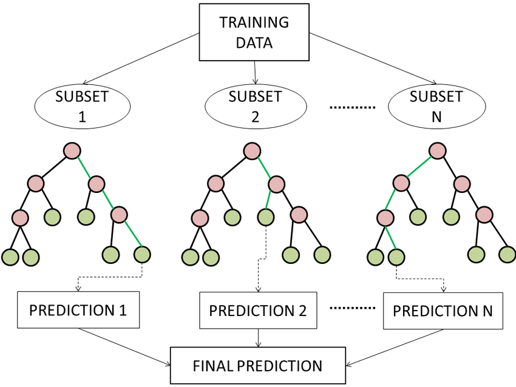

# 💫 Artificial Intelligence


### 🧠 Artificial intelligence (AI) is intelligence demonstrated by machines, as opposed to intelligence of humans and other animals. 

Example tasks in which this is done include speech recognition, computer vision, translation between (natural) languages, as well as other mappings of inputs.

AI applications include advanced web search engines (e.g., Google Search), recommendation systems (used by YouTube, Amazon, and Netflix), understanding human speech (such as Siri and Alexa), self-driving cars (e.g., Waymo), generative or creative tools (ChatGPT and AI art), automated decision-making, and competing at the highest level in strategic game systems (such as chess and Go). 

As machines become increasingly capable, tasks considered to require "intelligence" are often removed from the definition of AI, a phenomenon known as the AI effect. For instance, optical character recognition is frequently excluded from things considered to be AI, having become a routine technology.

Artificial intelligence was founded as an academic discipline in 1956, and in the years since it has experienced several waves of optimism, followed by disappointment and the loss of funding (known as an "AI winter"), followed by new approaches, success, and renewed funding. AI research has tried and discarded many different approaches, including simulating the brain, modeling human problem solving, formal logic, large databases of knowledge, and imitating animal behavior. In the first decades of the 21st century, highly mathematical and statistical machine learning has dominated the field, and this technique has proved highly successful, helping to solve many challenging problems throughout industry and academia.


The various sub-fields of AI research are centered around particular goals and the use of particular tools. The traditional goals of AI research include reasoning, knowledge representation, planning, learning, natural language processing, perception, and the ability to move and manipulate objects. General intelligence (the ability to solve an arbitrary problem) is among the field's long-term goals. To solve these problems, AI researchers have adapted and integrated a wide range of problem-solving techniques, including search and mathematical optimization, formal logic, artificial neural networks, and methods based on statistics, probability, and economics. AI also draws upon computer science, psychology, linguistics, philosophy, and many other fields.

Artificial intelligence is a branch of computer science that aims to create intelligent machines. It has become an essential part of the technology industry.

###### 📊 Research associated with artificial intelligence is highly technical and specialized. The core problems of artificial intelligence include programming computers for certain traits such as:


* 💡 Knowledge 

* 💡 Reasoning 

* 💡 Problem solving 

* 💡 Perception 

* 💡 Learning

* 💡 Planning  

* 💡 Ability to manipulate and move objects

```bash
This topic will take some update and patch note during this year 2024
```
# 💫 Machine Learning

#### Knowledge engineering is a core part of AI research. Machines can often act and react like humans only if they have abundant information relating to the world. Artificial intelligence must have access to objects, categories, properties and relations between all of them to implement knowledge engineering. Initiating common sense, reasoning and problem-solving power in machines is a difficult and tedious task.


#### 🤖 Machine learning is also a core part of AI. Learning without any kind of supervision requires an ability to identify patterns in streams of inputs, whereas learning with adequate supervision involves classification and numerical regressions.


Classification determines the category an object belongs to and regression deals with obtaining a set of numerical input or output examples, thereby discovering functions enabling the generation of suitable outputs from respective inputs. Mathematical analysis of machine learning algorithms and their performance is a well-defined branch of theoretical computer science often referred to as computational learning theory.

Machine perception deals with the capability to use sensory inputs to deduce the different aspects of the world, while computer vision is the power to analyze visual inputs with a few sub-problems such as facial, object and gesture recognition.

Robotics is also a major field related to AI. Robots require intelligence to handle tasks such as object manipulation and navigation, along with sub-problems of localization, motion planning and mapping..

Source: ```https://www.techopedia.com/downloads.``` 

## Machine Learning Algorithm

### 1. Neural Network 


* A neural network is a type of machine learning algorithm that is inspired by the structure and function of the human brain, and consist of interconnected processing nodes that are organized into layers.

### 2. Logistic Regression  
* Logistic Regression is a Supervised statistical technique to find the probability of dependent variable.

* The Logistic Regression instead for fitting the best fit line, condenses the output of the linear function between 0 and 1.


* In the formula of the logistic mode, when b0 + b1x = 0, then the p will be 0.5, similarly, b0 + b1x > 0, then the p will be going towards 1 and b0 + b1x < 0, then the p will be going towards 0.

### 3. Linear Regression
A Linear Regression model representation is a linear equation:


Learning a LR means estimating the coefficients from the training data. Common methods include Gradient Descent or Ordinary Least Squares.

#### Variations
* Lasso Regression : where OLS is modified to minimize the `sum` of the coefficients (`L1 regularization`)

* Ridge Regression : where OLS is modified to minimize the `squared sum` of the coefficients (`L2 regularization`)

### 4. Central limit theorem
For `large` sample sizes, the sampling distribution of `means` will approximate to `normal distribution` even if the population distribution is not normal.

 

Above picture, shows 3 different `population` distributions which are `not normal`. `Sampling` distribution of `means` gets a little closer to normal distribution when we take n = 5 and almost normal distribution when `n=30` 

### 5. R-Square 
R-square(R²) is also known as the `coefficient of determination`, It is the `proportion` of variation in `Y explained by` the independent variables `X`. It is the measure of goodness of fit of the model.



If R² is 0.8 it means `80% of the variation` in the output can be explained by the `input variable`.

### 6. Random Forest



#### Random Forest
A random forest is a type of ensemble learning algorithm that trains multiple decision tress on random subsets of the data and then combines their predictions to make a final prediction. This can improve the performance of the model compared to using a single decision tree.

#### Random Forest Workflow chart  



### 7. Support Vector Machines
#### SVM algorithm


Support vector machines (SVMs) are a type of machine learning algorthm that is used for classification and regression tasks and finds the hyperplane that maximally separates the classes in the data.

Support Vector Machine (SVM) is a powerful machine learning algorithm used for linear or nonlinear classification, regression, and even outlier detection tasks. SVMs can be used for a variety of tasks, such as text classification, image classification, spam detection, handwriting identification, gene expression analysis, face detection, and anomaly detection. SVMs are adaptable and efficient in a variety of applications because they can manage high-dimensional data and nonlinear relationships.

SVM algorithms are very effective as we try to find the maximum separating hyperplane between the different classes available in the target feature.

### 8. Nearest Neighbour
#### Nearest neighbour algorithm


Neareast neighbor is a type of machine learning algorithm that makes predictions for a sample by finding the most similar samples in the training data and using their labels to make a prediction

## Seaborn joint plot


#### Python – seaborn.jointplot() method
`Seaborn` is a Python data visualization library based on `matplotlib`. It provides a high-level interface for drawing attractive and informative statistical graphics. Seaborn helps resolve the two major problems faced by Matplotlib; the problems are ?

* Default Matplotlib parameters
* Working with data frames

As Seaborn compliments and extends Matplotlib, the learning curve is quite gradual. If you know Matplotlib, you are already half-way through Seaborn.

#### seaborn.jointplot() : 
Draw a plot of two variables with bivariate and univariate graphs. This function provides a convenient interface to the ‘JointGrid’ class, with several canned plot kinds. This is intended to be a fairly lightweight wrapper; if you need more flexibility, you should use :class:’JointGrid’ directly.

```bash
Syntax: seaborn.jointplot(x,  y,  data=None, kind=’scatter’, stat_func=None, color=None, height=6, ratio=5, space=0.2, dropna=True,  xlim=None, ylim=None, joint_kws=None, marginal_kws=None, annot_kws=None, **kwargs)


Parameters: The description of some main parameters are given below:

x, y: These parameters take Data or names of variables in “data”.

data: (optional) This parameter take DataFrame when “x” and “y” are variable names.

kind: (optional) This parameter take Kind of plot to draw.

color:  (optional) This parameter take Color used for the plot elements.

dropna: (optional) This parameter take boolean value, If True, remove observations that are missing from “x” and “y”.

Return: jointgrid object with the plot on it.
```
Below is the implementation of above method:

#### Example 1:

#### Input:

```bash
# importing required packages 
import seaborn as sns 
import matplotlib.pyplot as plt 
  
# loading dataset 
data = sns.load_dataset("attention") 
  
# draw jointplot with 
# hex kind 
sns.jointplot(x = "solutions", y = "score", 
              kind = "hex", data = data)    
# show the plot 
plt.show() 
```
#### [Output:](https://github.com/flexycode/Artificial-Intelligence/blob/master/images/10.Seaborn-Output1.png)


```bash
# Just click the output link to view the result
```
#### Example 2:

#### Input: 

```bash
 
# importing required packages 
import seaborn as sns 
import matplotlib.pyplot as plt  
  
# loading dataset  
data = sns.load_dataset("mpg") 
  
# draw jointplot with 
# scatter kind 
sns.jointplot(x = "mpg", y = "acceleration", 
              kind = "scatter", data = data) 

# show the plot 
plt.show()
  
```
#### [Output:](https://github.com/flexycode/Artificial-Intelligence/blob/master/images/10.Seaborn-Output2.png)


```bash 
# Just click the output link to view the result
```
#### Example 3:

#### Input: 
```bash
 # importing required packages 
import seaborn as sns 
import matplotlib.pyplot as plt 
  
# loading dataset 
data = sns.load_dataset("exercise") 
  
# draw jointplot with 
# kde kind 
sns.jointplot(x = "id", y = "pulse", 
              kind = "kde", data = data)  
# Show the plot 
plt.show() 
```
#### [Output:](https://github.com/flexycode/Artificial-Intelligence/blob/master/images/10.Seaborn-Output3.png)


```bash
# Just click the output link to view the result
```

#### Example 4:

#### Input: 
```bash
# importing required packages 
import seaborn as sns 
import matplotlib.pyplot as plt 
  
# loading dataset 
data = sns.load_dataset("titanic")  
  
# draw jointplot with 
# reg kind 
sns.jointplot(x = "age", y = "fare", 
              kind = "reg", data = data, 
              dropna = True) 
  
# show the plot 
plt.show()
 
```

#### [Output:](https://github.com/flexycode/Artificial-Intelligence/blob/master/images/10.Seaborn-Output4.png)


```bash
# Just click the output link to view the result
```

# Samples, Reference Architectures & Best Practices

This repository is meant to organize Microsoft's Open Source AI based repositories.

# Keywords
batch scoring, realtime scoring, model training, MLOps, Azure Machine Learning, computer vision, natural language processing, recommenders

## Table of contents
1. [Getting Started](#Getting-Started)
2. [AI100 - Samples](#ai100)
3. [AI200 - Reference Architectures](#ai200)
4. [AI300 - Best Practices](#ai300) 
6. [Contributing](#Contributing)

# Getting Started <a name="Getting-Started"></a>
This repository is arranged as submodules so you can either pull all the tutorials or simply the ones you want. 
To pull all the tutorials run:

```bash
git clone --recurse-submodules https://github.com/microsoft/ai
```

if you have git older than 2.13 run:

```bash
git clone --recursive https://github.com/microsoft/ai.git
``` 

To pull a single submodule (e.g. DeployDeepModelKubernetes) run:
```
git clone https://github.com/microsoft/ai 
cd ai
git submodule init submodules/DeployDeepModelKubernetes
git submodule update
```
# [AI100 - Samples](https://azure.microsoft.com/en-us/overview/ai-platform/)<a name="ai100"></a>
Samples are a collection of open source Python repositories created by the Microsoft product teams, which focus on AI services.  

| Title | Description | 
|-------|-------------|
| [Azure ML Python SDK](https://github.com/Azure/MachineLearningNotebooks)|Python notebooks with ML and deep learning examples with Azure Machine Learning|  
| [Azure Cognitive Services Python SDK](https://github.com/Azure-Samples/cognitive-services-python-sdk-samples)|Learn how to use the Cognitive Services Python SDK with these samples |
| [Azure Intelligent Kiosk](https://github.com/microsoft/Cognitive-Samples-IntelligentKiosk)|Here you will find several demos showcasing workflows and experiences built on top of the Microsoft Cognitive Services.|
| [MML Spark Samples](https://github.com/Azure/mmlspark/tree/master/notebooks/samples)|MMLSpark is an ecosystem of tools aimed towards expanding the distributed computing framework Apache Spark in several new directions.|
| [Seismic Deep Learning Samples](https://github.com/microsoft/seismic-deeplearning/)|Deep Learning for Seismic Imaging and Interpretation.| 


# AI300 - Best Practices <a name="ai300"></a>
Our best practices are arranged by topic. Each best pratice repository includes open source methods, along with considerations for scalability, availability, manageability, and security.

| Title | Description | 
|-------|-------------|
|[Computer Vision](https://github.com/microsoft/computervision)| Accelerate the development of computer vision applications with examples and best practice guidelines for building computer vision systems
|[Natural Language Processing](https://github.com/microsoft/nlp)|State-of-the-art methods and common scenarios that are popular among researchers and practitioners working on problems involving text and language.|
|[Recommenders](https://github.com/microsoft/recommenders)| Examples and best practices for building recommendation systems, provided as Jupyter notebooks.| 
|[MLOps](https://github.com/microsoft/MLOps)| MLOps empowers data scientists and app developers to help bring ML models to production. |


## Recommend a Scenario
If there is a particular scenario you are interested in seeing a tutorial for please fill in a [scenario suggestion](https://github.com/Microsoft/AIReferenceArchitectures/issues/new?assignees=&labels=&template=scenario_request.md&title=%5BSCENARIO%5D)

## Ongoing Work
We are constantly developing interesting AI reference architectures using Microsoft AI Platform. Some of the ongoing projects include IoT Edge scenarios, model scoring on mobile devices, add more... To follow the progress and any new reference architectures, please go to the AI section of this [link](https://docs.microsoft.com/en-us/azure/architecture/reference-architectures/).

# Contributing <a name="Contributing"></a>

This project welcomes contributions and suggestions.  Most contributions require you to agree to a
Contributor License Agreement (CLA) declaring that you have the right to, and actually do, grant us
the rights to use your contribution. For details, visit https://cla.microsoft.com.

When you submit a pull request, a CLA-bot will automatically determine whether you need to provide
a CLA and decorate the PR appropriately (e.g., label, comment). Simply follow the instructions
provided by the bot. You will only need to do this once across all repos using our CLA.

This project has adopted the [Microsoft Open Source Code of Conduct](https://opensource.microsoft.com/codeofconduct/).
For more information see the [Code of Conduct FAQ](https://opensource.microsoft.com/codeofconduct/faq/) or
contact [opencode@microsoft.com](mailto:opencode@microsoft.com) with any additional questions or comments.

# 💫 Roadmap 

### Roadmap for Artificial Intelligence and Machine Learning

https://github.com/flexycode/AI-Expert-Roadmap

### Roadmap for Machine Learning

### Roadmap for Data Science 


